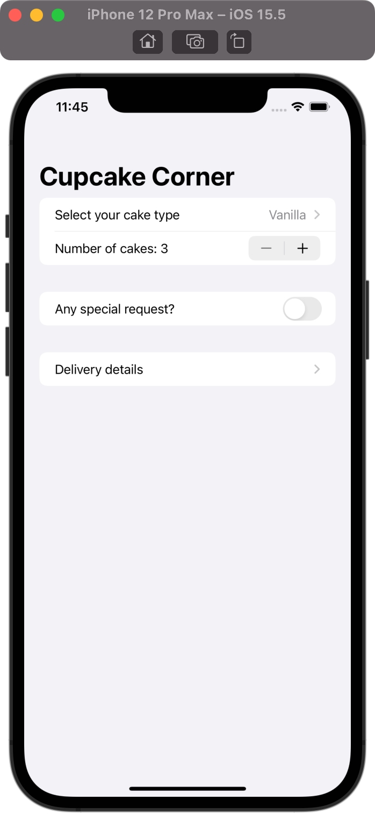
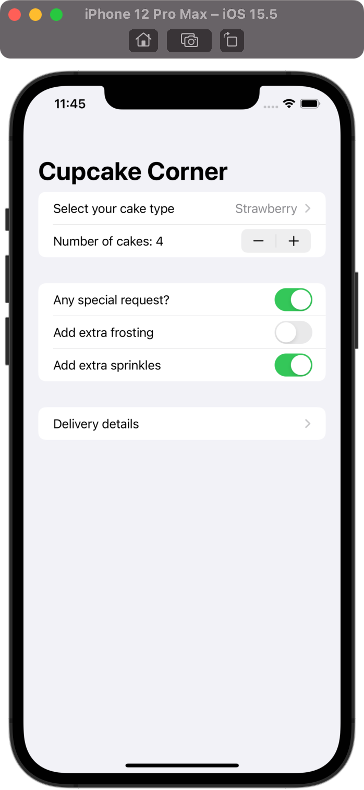
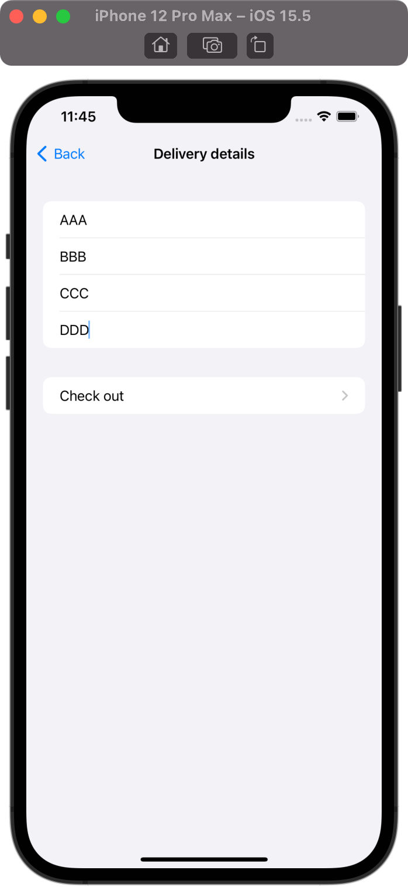
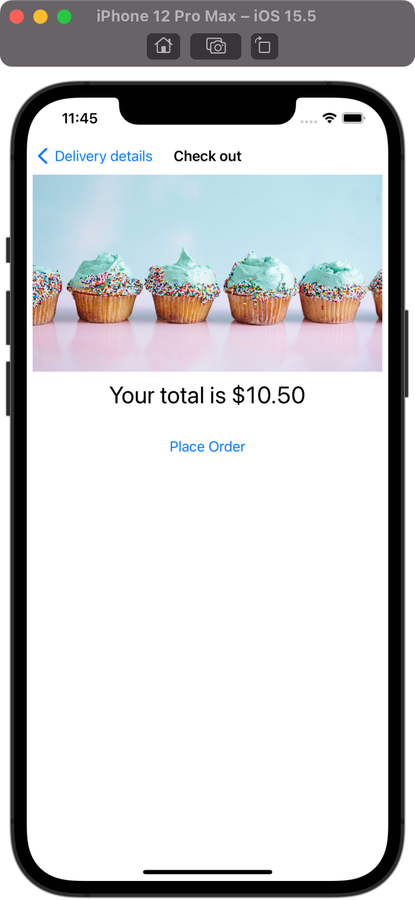
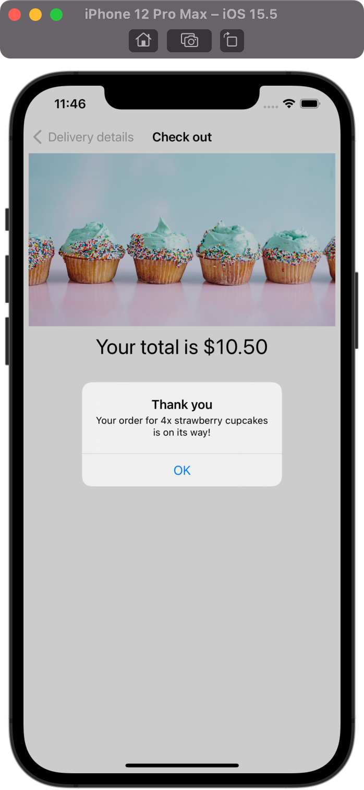

# CupcakeCorner

## Project Description

The project is a part of 100 Days of SwiftUI curriculum by Paul Hudson [Hacking with swift](https://www.hackingwithswift.com/100/swiftui)

In this project is a multi-screen app for ordering cupcakes. This will use a couple of forms with classes conforming to Codable when they have @Published properties, send and receive the order data from the internet, validate forms, and more.

## Project Screen

  
 
